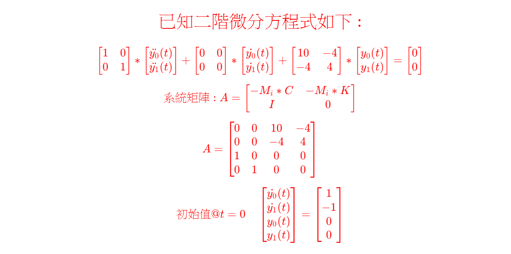
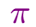

<!--     App_CSharp   GitHub Repo       -->


<!-- 
#
# \[{   \color{Fuchsia}精\;銳\;矩\;陣\;計\;算\;求\;解\;器   }\]  
####  \[{  \color{Green} 【Sharp \; Matrix \; Solver \quad \; S\;M\;S】    }\]  
-->
  


#
  
<!--      
#### \[{   \color{Brown} S\;M\;S\;之\;測\;試\;實\;例\;採\;用\;:   }\]
#### \[{  \color{Brown} Dennis \quad G. \quad Zill     }\]  
#### \[{  \color{Brown} Differential \; Equations \; with \; Boundary-Value \; Problems \; 9th \; Edition )  }\]  
#### \[{    \color{Brown} 第 \; 322 \; 頁 \quad 至 \quad 第 \; 323 \; 頁        }\]  
-->  


    
<!--    
###  \[{   \color{Red}  已知二階微分方程式如下 :    }\]

###### \[{  \color{Red} \begin{bmatrix} 1 & 0 \\ 0 & 1 \end{bmatrix} \ast \begin{bmatrix} \ddot{y_0}(t) \\ \ddot{y_1}(t) \end{bmatrix} + \begin{bmatrix} 0 & 0 \\ 0 & 0 \end{bmatrix} \ast \begin{bmatrix} \dot{y_0}(t) \\ \dot{y_1}(t) \end{bmatrix} + \begin{bmatrix} 10 & -4 \\ -4 & 4 \end{bmatrix} \ast \begin{bmatrix} y_0(t) \\ y_1(t) \end{bmatrix} = \begin{bmatrix} 0 \\ 0 \end{bmatrix}  }\] 
######  \[{ \color{Red} 系統矩陣: A = \begin{bmatrix} -M_i\ast C & -M_i\ast K \\ I & 0 \end{bmatrix} }\]
######  \[{  \color{Red} A = \begin{bmatrix} 0 & 0 & 10 & -4 \\ 0 & 0 & -4 & 4 \\ 1 & 0 & 0 & 0 \\ 0 & 1 & 0 & 0 \end{bmatrix} }\] 
###### \[{  \color{Red}  初始值@t = 0 \quad  \begin{bmatrix} \dot{y_0}(t) \\ \dot{y_1}(t) \\ y_0(t) \\ y_1(t) \end{bmatrix} = \begin{bmatrix} 1 \\ -1 \\ 0 \\ 0  \end{bmatrix}  }\]  
-->  


##
##### 一般都是使用 Laplace Transform 求解，但【SMS求解器】是直接求解微分方程式。
##### 相關的C# 程式碼參見 App41.cs 檔案，或是 [GitHub App_41 儲存庫](https://github.com/myyeh2/App_41) 。
##### 使用精銳矩陣計算求解器，實際驗證實例儲存庫如下 :      
##### App_6J，App_6M，App_6P，App_6R，App_38，App_40，App_41等7個儲存庫。 
##### 狀態空間響應【數值化輸出】和資料視覺化圖示(使用Excel和Matplotlib.pyplot套件)，參見對應的App_XX儲存庫 （ Repository ）。


---  


求解二階微分方程式，電機系的```訊號與系統```、```線性系統 ```、機械系的```控制系統```、和土木系的```結構動力學```，都有相同的求解問題，使用Laplace Transform、Fourier Transform、或是Z Transform等等。但本例是使用Laplace 和 Inverse Laplace Transform求得狀態空間響應。
 
 空間維度【Space Dimension】有二個自由度Degree of Freedom( m = 2 )，狀態維度【State Dimension】有二個自由度( r = 2 )，即二階微分，時間維度【Time Dimension】是時間軸上的函數，可以任意選取時間軸上的任何點，整個【系統矩陣】 A 為(mXr)X(mXr)即4X4 【非對稱正方形實數矩陣】，狀態變數共有 m * (r + 1) 個。於C#程式碼中，引用Matrix_0類別庫，即程式碼的開頭是引用 ```using Matrix_0；``` 名稱空間(namespace)。   
 
 系統矩陣 A 是非對稱正方形實數矩陣，則系統特徵值和特徵向量，預設值是複數矩陣(Complex Matrix)，參考C#程式碼、精銳矩陣計算求解器(SMS)類別庫、和輸出的結果。  

 引用學者的評論，[. . . “Experimental results are believed by everyone, except by the person who ran the experiment. Computational results are believed by no one, except by the person who wrote the code.”  另一次，則是在研討會中聽到有學者開玩笑的說 「參加競賽的論文，若沒呈現實驗量測設備，那就會先被挑掉。. . .」](http://www.etop.org.tw/index.php?d=epp&c=epp13911&m=show&id=646)。 

量測的數據是離散性質，而且動態系統的部分數據，無法精準量測，譬如角速度 【 2 *  * f =  f 是頻率 】 和 模態 ( Mode shape ) ， 頻率和模態都是複數，但量測的數據，是C#程式碼輸出【複數數據】的絕對值，或稱模數( Modulus )。動態系統中，設 A 是系統矩陣( 或稱狀態矩陣 )，其複數的特徵值是角速度，複數的特徵向量是模態。但量測僅能測得狀態空間變數( State-space Variables )的實數數據。但使用程式碼，可得到更寬廣的詳細數值，參見儲存庫的程式碼，甚至依據自己的需求條件，稍微修改程式碼，可得到自己要的數據，本儲存庫的程式碼，除了 ```Matrix_0.dll``` 檔案外，都是公開在 ```github/myyeh2``` 上。 

從古至今，複數使人產生困惑，但```訊號與系統``` 、 ```控制系統``` 、 ```量子力學的波函數``` 等等的學科，仍然需要使用複數的計算。所有的計算，應該從【實數】的系統矩陣 A 開始，將 A 矩陣對角化，但重要的部分是，無法實際轉爲【實數的對角線矩陣】，必需使用【複數的對角線矩陣】，這部分是線性代數最重要的部分，好像也較少人談及，接下來就是求解特徵向量。複數的特徵值與特徵向量是共軛( Self Adjoint )的關係，也就就是對應的複數頻率與與複數模態。我們知道複數矩陣的計算 —— 任何複數與複數的運算、或是複數與實數的運算，其結果都是複數。或許有人會懷疑如果是共軛的關係，結果是實數。但以C#程式語言的眼光來看，複數(Complex Number)的範圍大於等於實數(Real Number)的範圍，實數轉爲複數叫作【Implicit Converter】，複數轉爲實數叫作【Explicit Converter】，其必要條件是虛數的值為零，否則就失敗( Exception )了。故接下來的計算都是複數矩陣的計算了，我們求解狀態空間變數【State-space Variables】的響應值，其結果當然是複數，如果您發現複數的虛數值為零時，就可以再轉囘到實數的值，也就是回到實數(Real Number)真實(Real World)的世界了。所有動態系統的計算過程，都應該由實數的數值開始，再轉到範圍較廣的複數運算，最後再轉回到實數(Real Number)、真實的世界(Real World)。但【實際的量測，無法做到這一點，唯有使用程式碼，才可窺見整個動態系統的詳細過程】。 這也就是我認同 **Computational results are believed by no one, except by the person who wrote the code.** 的理由。 
##  


--- 

### 我的結論如下 :   

1. **由【實數】系統(或稱狀態)矩陣 'A' 的計算【開始】，最後到實數矩陣計算的【結束】，【中間】需要複數矩陣的計算。**
2. **複數實際並不存在，僅是中間補助計算的功能，但其運算法則完全與實數的運算法則相同。**
3. **不對稱矩陣的計算困難度 ```大於``` 對稱矩陣的計算困難度。** 
4. **以CSharp程式語言撰寫的觀念而言，複數矩陣的範疇(Scope) ```大於等於``` 實數矩陣的範疇，兩者可互相【Implicit】或是【Explicity】轉換。** 
5. **希爾伯特空間 Hilbert Space 的理念，實際上就是【複數矩陣】的計算問題，精銳矩陣計算求解器能有效處理**

##

### 存疑的地方如下： 

**本人知識有限，也請專家學者指正。**
* **對於 ```訊號與系統 ``` 、 ```控制系統``` 、 ```線性系統``` 等等學科，直接使用假設的複數值，而不是使用真實的實數值，作爲開始計算的已知數據，表示存疑。且本身就是複數，而不是僅僅包含虛數部分(Imaginary Part)而已。** 
###
* **對於 ```量子力學``` 中的 Shrodinger 方程式和波函數，本身包含虛數，是否有問題？**  
  
**本人存疑的地方，就是基於如上所述的理由。**  
 


##
