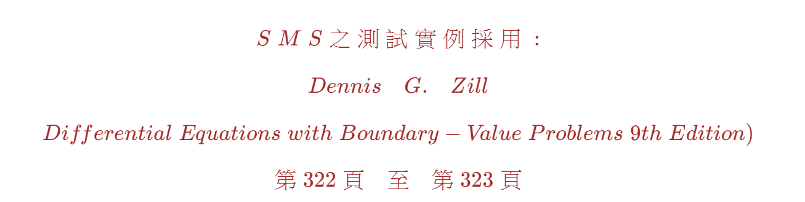

<!--     App_CSharp   GitHub Repo       -->


<!-- 
#
# \[{   \color{Fuchsia}精\;銳\;矩\;陣\;計\;算\;求\;解\;器   }\]  
####  \[{  \color{Green} 【Sharp \; Matrix \; Solver \quad \; S\;M\;S】    }\]  
-->
  


#
  
<!--      
#### \[{   \color{Brown} S\;M\;S\;之\;測\;試\;實\;例\;採\;用\;:   }\]
#### \[{  \color{Brown} Dennis \quad G. \quad Zill     }\]  
#### \[{  \color{Brown} Differential \; Equations \; with \; Boundary-Value \; Problems \; 9th \; Edition )  }\]  
#### \[{    \color{Brown} 第 \; 322 \; 頁 \quad 至 \quad 第 \; 323 \; 頁        }\]  
-->  


    
<!--    
###  \[{   \color{Red}  已知二階微分方程式如下 :    }\]

###### \[{  \color{Red} \begin{bmatrix} 1 & 0 \\ 0 & 1 \end{bmatrix} \ast \begin{bmatrix} \ddot{y_0}(t) \\ \ddot{y_1}(t) \end{bmatrix} + \begin{bmatrix} 0 & 0 \\ 0 & 0 \end{bmatrix} \ast \begin{bmatrix} \dot{y_0}(t) \\ \dot{y_1}(t) \end{bmatrix} + \begin{bmatrix} 10 & -4 \\ -4 & 4 \end{bmatrix} \ast \begin{bmatrix} y_0(t) \\ y_1(t) \end{bmatrix} = \begin{bmatrix} 0 \\ 0 \end{bmatrix}  }\] 
######  \[{ \color{Red} 系統矩陣: A = \begin{bmatrix} -M_i\ast C & -M_i\ast K \\ I & 0 \end{bmatrix} }\]
######  \[{  \color{Red} A = \begin{bmatrix} 0 & 0 & 10 & -4 \\ 0 & 0 & -4 & 4 \\ 1 & 0 & 0 & 0 \\ 0 & 1 & 0 & 0 \end{bmatrix} }\] 
###### \[{  \color{Red}  初始值@t = 0 \quad  \begin{bmatrix} \dot{y_0}(t) \\ \dot{y_1}(t) \\ y_0(t) \\ y_1(t) \end{bmatrix} = \begin{bmatrix} 1 \\ -1 \\ 0 \\ 0  \end{bmatrix}  }\]  
-->  


##
##### 一般都是使用 Laplace Transform 求解，但【SMS求解器】是直接求解微分方程式。
##### 相關的C# 程式碼參見 App41.cs 檔案，或是 [GitHub App_41 儲存庫](https://github.com/myyeh2/App_41) 。
##### 使用精銳矩陣計算求解器，實際驗證實例儲存庫如下 :      
##### App_6J，App_6M，App_6P，App_6R，App_38A，App_40，App_41等7個儲存庫。 
##### 狀態空間響應【數值化輸出】和資料視覺化圖示(使用Excel和Matplotlib.pyplot套件)，參見對應的App_XX儲存庫 （ Repository ）。


---  

### 我的解釋如下 ： 

>  ***爲了求解微分方程式，電機系的```訊號與系統```、```線性系統 ```; 機械系的```控制系統```；和土木系的```結構動力學```，都有相同微分方程式的求解問題，使用Laplace Transform、Fourier Transform、Z Transform、或是捲積分法、Runge-Kutta 法等等。本例是使用Laplace Transform的方法，求得微分方程式的狀態空間響應【State-space Response】。*** 
>
>   ***在空間維度【Space Dimension】上，有二個自由度Degree of Freedom( m = 2 )，在狀態維度【State Dimension】上，也有二個自由度( r = 2 )，即二階微分方程式，在時間維度【Time Dimension】上，是時間軸上的函數，可以任意選取時間軸上的任何點。整個【系統矩陣】或是稱【狀態矩陣】 A 為(mXr)X(mXr) 【非對稱正方形4X4實數矩陣】，狀態空間變數共有 m * (r + 1) 個。*** 
>
>  ***雖然系統矩陣 A 是非對稱正方形實數矩陣，但是系統特徵值 D 和系統特徵向量 Q，預設是複數矩陣(Complex Matrix)，參考Github儲存庫中，精銳矩陣計算求解器(SMS)程式碼和相關的輸出結果。*** 
>
>  ***引用學者的評論，[. . . “Experimental results are believed by everyone, except by the person who ran the experiment. Computational results are believed by no one, except by the person who wrote the code.”  另一次，則是在研討會中聽到有學者開玩笑的說 「參加競賽的論文，若沒呈現實驗量測設備，那就會先被挑掉。. . .」](http://www.etop.org.tw/index.php?d=epp&c=epp13911&m=show&id=646)。*** 
>
>  ***量測的數據是離散性質，僅知道數值而已，並不知道其所以然，但使用程式碼作數值模擬求解，可以知道系統的整體中間過程狀態。***  

---  


# 從古至今，複數使人產生困惑。但【訊號與系統】、【控制系統】、【量子力學的波函數】等等的學科，仍然使用複數的計算，顯然複數的計算有其必要性，爲何會是如此！？
##  


> ***所有的微分方程式是由，空間維度( 共計有m個自由度 )和多階狀態維度( 共計有r個自由度 )所組成，複數數值的計算，應該從微分方程式的求解開始。***  
> ***將微分方程式轉化爲【非對稱實數正方形】的系統矩陣 A ，再將 A 矩陣對角線化，但重要的部分是，無法實際將 A 矩陣轉爲【實數】的對角線矩陣，而是【複數】的對角線矩陣，這部分是線性代數重要的部分，好像也較少人談及。*** 
> ***接下來的計算都是複數矩陣的計算，求解複數特徵值矩陣和複數特徵向量矩陣。兩者是共軛( Self Adjoint )的關係。***   
> ***複數的特徵值，實數部分與振幅相關，虛數部分就是角速度，角速度 【 2 *  * f =  f 是頻率 】。複數的特徵向量就是對應系統的模態。***      
> ***頻率是虛數值，模態是複數值，直接使用儀器去量測這些數據，僅是其絕對值或稱模數( Modulus )而已，已經失掉了方向性和動態性。但使用程式碼，可得到更寬廣的詳細數值，甚至依據自己的需求條件，稍微修改程式碼，可得到自己要的數據。儲存庫的程式碼都是公開在 : ```github.com/myyeh2``` 即  [GitHub儲存庫上](https://github.com/myyeh2) 。*** 

> ***程式語言有較大的靈活性，複數(Complex Number)的範圍大於等於實數(Real Number)的範圍，實數轉爲複數叫作【Implicit Converter】，複數轉爲實數叫作【Explicit Converter】，其必要條件是虛數的值為零，否則就失敗( Exception )了。***  
>
> ***複數矩陣計算困難度大於實數矩陣，但SMS求解器運算子能有效處理實數與複數矩陣的計算，包含加、減、乘、除、水平和垂直合并、内積、求逆、轉置、等等。***      

> ***求解狀態空間變數【State-space Variables】的響應值，其結果當然是複數，如果您發現複數的虛數值為零時，就可以再轉囘到實數的值，也就是回到實數(Real Number)真實(Real World)的世界了。所有動態系統的計算過程，都應該由實數的數值開始，再轉到範圍較廣的複數運算，最後再轉回到實數(Real Number)、真實的世界(Real World)。但【實際的量測，無法做到這一點，唯有使用程式碼，才可窺見整個動態系統的詳細過程】。***

>  ***這也就是我認同 **Computational results are believed by no one, except by the person who wrote the code.** 的理由。***  


<!--      
量測的數據是離散性質，而且動態系統的部分數據，無法精準量測，譬如角速度 【 2 *  * f =  f 是頻率 】 和 模態 ( Mode shape ) ， 頻率是虛數值和模態是複數，但量測的數據，是C#程式碼輸出【複數數據】的絕對值，或稱模數( Modulus )。動態系統中，設 A 是實數系統矩陣( 或稱狀態矩陣 )，求得複數的特徵值，其中實數的部分與振幅有關，虛數的部分是角速度，複數的特徵向量是模態。但量測僅能測得狀態空間變數( State-space Variables )的實數數據。但使用程式碼，可得到更寬廣的詳細數值，參見儲存庫的程式碼，甚至依據自己的需求條件，稍微修改程式碼，可得到自己要的數據，本儲存庫的程式碼，除了 ```Matrix_0.dll``` 檔案外，都是公開在 ```github/myyeh2``` 上。 

從古至今，複數使人產生困惑，但```訊號與系統``` 、 ```控制系統``` 、 ```量子力學的波函數``` 等等的學科，仍然需要使用複數的計算。所有**多維度多階的數值計算**，應該從【實數】的系統矩陣 A 開始，將 A 矩陣對角化，但重要的部分是，無法實際轉爲【實數的對角線矩陣】，必需使用【複數的對角線矩陣】，這部分是線性代數最重要的部分，好像也較少人談及，接下來就是求解特徵向量。複數的特徵值與特徵向量是共軛( Self Adjoint )的關係，也就就是對應的複數頻率與與複數模態。我們知道複數矩陣的計算 —— 任何複數與複數的運算、或是複數與實數的運算，其結果都是複數。或許有人會懷疑如果是共軛的關係，結果是實數。但以C#程式語言的眼光來看，複數(Complex Number)的範圍大於等於實數(Real Number)的範圍，實數轉爲複數叫作【Implicit Converter】，複數轉爲實數叫作【Explicit Converter】，其必要條件是虛數的值為零，否則就失敗( Exception )了。故接下來的計算都是複數矩陣的計算了，我們求解狀態空間變數【State-space Variables】的響應值，其結果當然是複數，如果您發現複數的虛數值為零時，就可以再轉囘到實數的值，也就是回到實數(Real Number)真實(Real World)的世界了。所有動態系統的計算過程，都應該由實數的數值開始，再轉到範圍較廣的複數運算，最後再轉回到實數(Real Number)、真實的世界(Real World)。但【實際的量測，無法做到這一點，唯有使用程式碼，才可窺見整個動態系統的詳細過程】。 這也就是我認同 **Computational results are believed by no one, except by the person who wrote the code.** 的理由。 
##  
--> 

--- 

### 我的結論如下 :   

1. **求解常微分或是偏微分方程式，首先將方程式，先轉爲實數系統(或稱狀態)矩陣 'A' ，由實數矩陣的計算開始，中間需要轉爲複數矩陣的計算，最後再轉到實數矩陣計算，得到實數的計算結果。**
2. **複數實際並不存在，僅是中間補助計算的功能，但其運算法則完全與實數的運算法則相同。**
3. **不對稱矩陣的計算困難度 ```大於``` 對稱矩陣的計算困難度。複數矩陣的計算困難度 ```大於```實數矩陣的計算困難度** 
4. **以CSharp程式語言撰寫的觀念而言，複數矩陣的範疇(Scope) ```大於等於``` 實數矩陣的範疇，但兩者可互相【Implicit】或是【Explicity】轉換。** 
5. **希爾伯特空間 Hilbert Space ，實際上就是複數的計算問題，精銳矩陣計算求解器(SMS)，能有效處理複數的計算問題。** 
6. **配合複數的計算，使用矩陣計算工具，適合處理多維度多自由度的計算問題。**  
7. **著名的 Sturm-Liouville、Navier-Stokes、Helmholtz、Schrodinger 等等的微分方程式，實際上就是狀態與空間的求解問題。**  
##

### 存疑的地方如下： 
#### 
* **對於 ```訊號與系統 ``` 、 ```控制系統``` 、 ```線性系統``` 等等學科，直接使用假設的複數值，而不是使用真實的實數值，作爲開始計算的已知數據，表示存疑。** 
#### 
* **對於 ```量子力學``` 中的 Shrodinger 方程式和波函數，本人認爲虛數僅是中間的計算過程，但方程式本身包含虛數，是否有問題？**  
 


##

